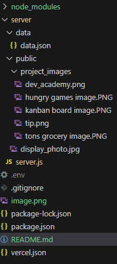
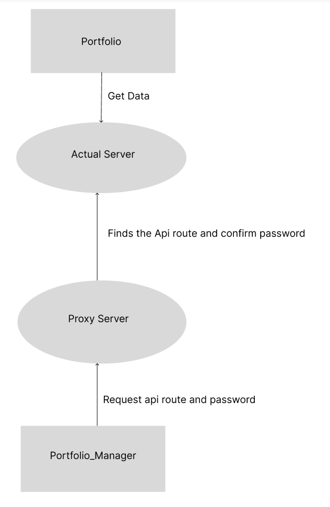

# My Portfolio (Server Side)
Hello everyone welcome to the server side of my portfolio website. Here I will explain everything how my portfolio gets all the data and images and how my portfolio manager manages all data whenever I want to add, edit or delete some stuff in my portfolio website 

# Server Deployment
I hosted this server using vercel and made a vercel.json file to configure the source of the routes and set the source of the main server to server/server.js like this
```json
{
  "builds":[{"src":"server/server.js", "use":"@vercel/node"}],
  "routes": [
    { "src": "/(.*)", "dest": "server/server.js" }
  ]
}
```

and I set the source to all endpoints to this "/(.*)"

# File Structure
-All the files that we need to make these server are stored in the server directory

-The other files including node_modules, package.json, README.md and vercel.json are stored on the root

-I use .env to hide all my api routes for security purposes and set those as environmental variables so vercel will able to read those routes




# Project Architecture


Basically the <strong>Portfolio</strong> gets the data straight from the server on the other hand, The <strong>Portfolio Manager</strong> will go to the proxy server to find the actual route and pass the body of the form including the password to the actual server to process the request

# Using Proxy Server

The main reason why I used proxy server is to avoid exposing the actual api endpoints on public and also to avoid hackers trying to manipulate the data using the actual route. I also find that using cors restriction is not enough to hide the server endpoint because its only applicable on browsers but not on Postman or Insomia.

